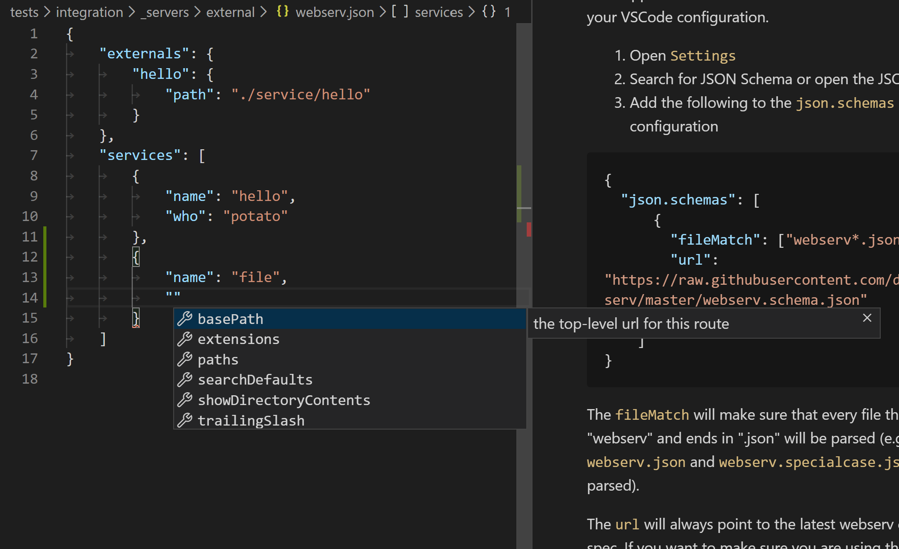

# webserv Configuration

Webserv supports more complex usage through config files. A configuration is useful as part of application development when a shared, persisted server description is necessary.

When webserv starts it looks for a file named `webserv.json` is present and automatically loads that as a configuration. A configuration may also be explicitly defined by launching `webserv` using the `-c <configPath>` option.

## Sample Configuration

Configurations are used to specify what [services] are part of a server. An example `webserv.json` file that includes a file service, an upload service, a crud route, and a custom service might look something like:

```
{
	"externals": {
		"myService": {
			"path": "./services/myService"
		}
	},
	"services": [
		{
			"name": "myService"
		},
		{
			"name": "file",
			"paths": {
				"/src/*": "./dist",
				"/aframe/*": "./node_modules/aframe",
				"/node_modules/*": "./node_modules",
				"*": "./src"
			}
		},
		{
			"name": "upload",
			"route": "/upload/*",
			"directory": "./uploadDirectory"
		},
		{
			"name": "crud",
			"route": "/users/*",
			"data": {
				"1": {
					"id": 1,
					"name": "Paul"
				}
			}
		}
	]
}
```

All service configurations include a `name` that refers to the service to be loaded and configuration options. Configuration options may be found on the type definitions in [src/config/services].

### Externals

Externals contain a list of modules that are loaded when webserv starts up. An external module has a single service loader that receives the configuration for the service and environment information and asynchronously returns a single service or a list of services.

```ts
export type ServiceLoader<C = any> = (config: C, env: Environment) => ServiceLoaderResult;
```

A basic "Hello World" service would look like:

```ts
import { Service } from 'webserv';
import { jsonTransform } from 'webserv/src/core/transforms/json.transform';

export interface Config {
	thing?: string;
}

export function helloWorldLoader(config: Config): Service {
	const thing = config.thing ?? 'world';
	return {
		route: {
			middleware: () => {
				return {
					'hello': thing
				}
			},
			transforms: [ jsonTransform ]
		}
	};
}
```

This service would accept a configuration with an optional `thing` property describing to what we are saying hello, the middleware returns an object, and the object is processed by `jsonTransform`.

#### TypeScript Externals

webserv knows how to load externals written in TypeScript! Internally webserv uses [ts-node](https://www.npmjs.com/package/ts-node) whenever a module with a `.ts` extension is loaded. No additional work is needed!

### Services

webserv contains a collection of common [services] useful for quickly bootstrapping functionality. A service is loaded using the `name` property and providing configuration for the service. See [services] for a list of included services or see the [Externals](#Externals) section above for more information on how to create your own.

## Configuration Schema

webserv uses JSON Schema to help ensure that the configuration files you write are syntactically correct. By adding a JSON Schema to your IDE or project's configuration your IDE will provide hints and automatic completion when working with a webserv configuration file.

### VSCode

VSCode has native support for [JSON Schema](https://code.visualstudio.com/docs/languages/json). The best way to add support for webserv JSON Schema is to add it globally to your VSCode configuration.

1. Open `Settings`
1. Search for JSON Schema or open the JSON view
1. Add the following to the `json.schemas` section of your configuration

```json
{
  "json.schemas": [
      {
        "fileMatch": ["webserv*.json"],
        "url": "https://raw.githubusercontent.com/devpaul/webserv/master/webserv.schema.json"
      }
    ]
}
```

The `fileMatch` will make sure that every file that starts with "webserv" and ends in ".json" will be parsed (e.g. `webserv.json` and `webserv.specialcase.json` will both be parsed).

The `url` will always point to the latest webserv configuration spec. If you want to make sure you are using the same webserv schema used by your package, you may instead configure your workspace to use `./node_modules/webserv/webserv.schema.json`.



[services]: ./services.md
[src/config/services]: https://github.com/devpaul/webserv/tree/master/src/config/services
